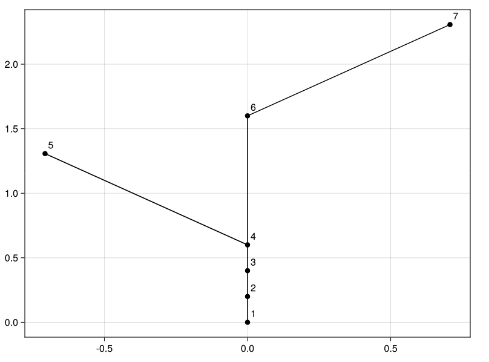

# Plotting

The companion package [`PlantGeom.jl`](https://github.com/VEZY/PlantGeom.jl) provides plots recipes to plot MTGs using either `Plots.jl` or `Makie.jl`.

To do so, you just have to use either of the packages, and choose a backend. Let's plot the MTG using CairoMakie:

```julia
# import Pkg; Pkg.add("CairoMakie"); Pkg.add("PlantGeom")
using CairoMakie, PlantGeom

file = joinpath(dirname(dirname(pathof(MultiScaleTreeGraph))),"test","files","simple_plant.mtg")
mtg = read_mtg(file)

diagram(mtg)
```

